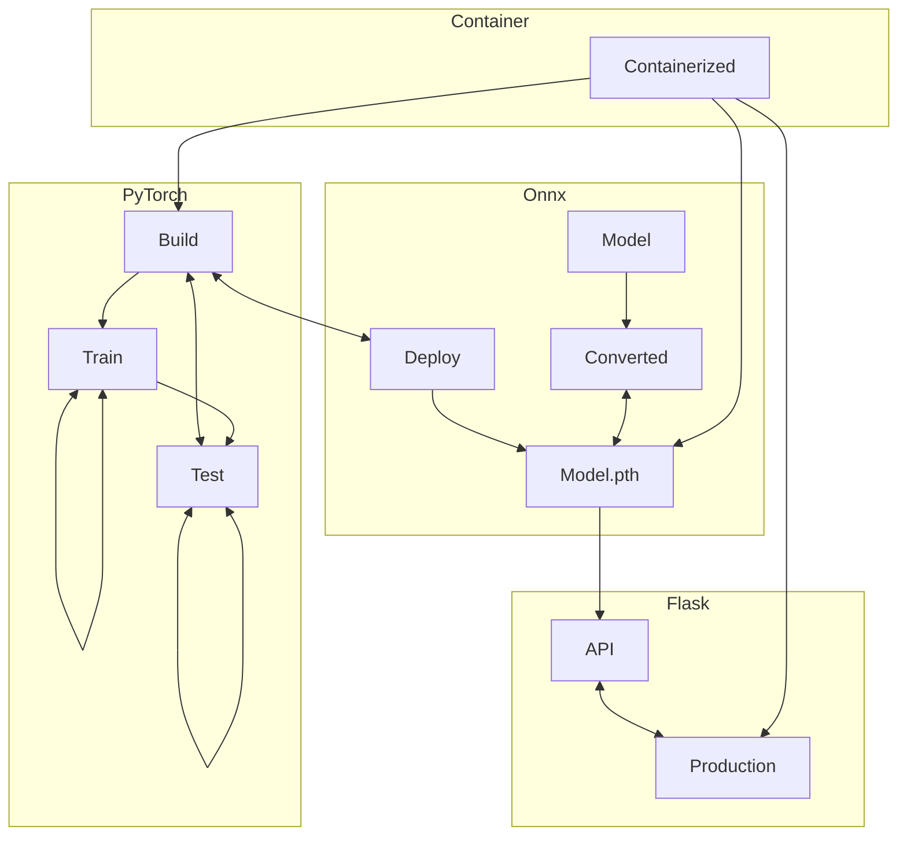
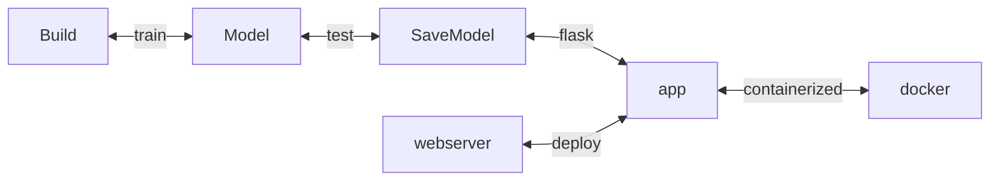

# Flask_PyTorch_DL
This repo contains a minimal example and demo to deploy any PyTorch model into WebApps

## Requirements
- Flask
- Docker
- Python3.x

## 

## Systems Architecture

# Flow

## TODO

## References